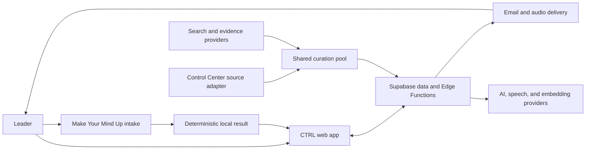

# CTRL architecture

Status: Current
Owner: Mindmaker
Last verified: 2026-09-05 against live Supabase containment readback; the Vercel frontend remains on the earlier `main` baseline and does not yet contain the branch-only recovery copy

CTRL is a Vite React application on Vercel with Supabase Auth, PostgreSQL, Edge Functions, Storage, Vault, and scheduled jobs. The architecture has one personal context substrate and one curation pool. Product surfaces are views over those shared systems.

## System context



## Runtime components

| Component | Responsibility | Source |
|---|---|---|
| SPA shell | Routing, auth boundary, persistent desktop/mobile chrome, recovery | `src/App.tsx`, `src/router.tsx`, `src/components/layout/` |
| Product surfaces | Today, Decide, Blind Spot, Memory, Briefing, Settings | `src/pages/` |
| Client orchestration | Queries, ranking, playback, memory, decisions, feedback | `src/hooks/`, `src/contexts/`, `src/lib/` |
| Supabase Edge Functions | AI calls, curation, decision evidence, handoff, delivery, billing | `supabase/functions/` |
| PostgreSQL | User context, decisions, curation cache, briefings, delivery claims, audit state | `supabase/migrations/` |
| Scheduled work | Prewarm, delivery, memory, watch, and lifecycle jobs | migrations using Vault, pg_cron, and pg_net |
| Vercel | Static assets, SPA routing, canonical and redirect hosts | `vercel.json` and project configuration |

The repository contains 115 Edge Function directories excluding `_shared`, 51 hook files, and 167 SQL migrations. These are measured source-tree inventory counts, not design targets.

## The Supabase project is shared

Read this before changing anything server-side.

CTRL does not have a Supabase project to itself. Project `bkyuxvschuwngtcdhsyg`, named "Mindmaker AI", hosts CTRL alongside other Mindmaker surfaces. Production readback on 2026-09-05 found 183 live Edge Functions. This repository contains 115 function directories; ownership must be established by name and source, not inferred from either count.

Three consequences that matter more than anything else on this page:

1. **Deployed does not mean CTRL's.** A function visible in the Supabase dashboard may belong to another product. Establish ownership from the repository source and an exact live-name readback before changing, redeploying, or rolling back it.
2. **Treat every repository function as production-significant.** The 44-route containment is a reviewed subset, not the complete deployment inventory. A missing in-repo caller is not evidence that a route is unused; providers, cron, and links in sent email can be callers too.
3. **The database is shared too.** Tables, roles, and cron jobs outside CTRL's own migrations exist and are not this repository's to alter. Scope every migration to the objects CTRL owns.

The 2026-09-05 emergency release contains 44 server routes: 35 return side-effect-free containment responses, seven require an exact non-empty service credential, one is bound to the authenticated user, and one permits only an exact service credential or authenticated owner. All 44 were ACTIVE with expected JWT settings and matching runtime source at readback. The exact contract lives in [`supabase/containment/manifest.json`](../../supabase/containment/manifest.json) and its production receipt in [`release-lock.production.json`](../../supabase/containment/release-lock.production.json).

The live cron schedule is recorded in [release state](./release-state.md), which is the authority for what is actually running rather than what a migration file requests.

## Frontend boundaries

- `src/router.tsx` is the route authority.
- `AuthedLayoutRoute` owns persistent authenticated chrome.
- `RequireAuth` owns the user boundary for protected routes.
- TanStack Query owns server-state caching. React contexts own cross-surface session state.
- `src/index.css` and the `ctrl-ds` tokens own the product visual system.
- `BrandLockup` owns the product mark. Do not recreate it as text.
- Lazy routes use one recoverable branded loading path and one stale-chunk retry.

The complete current route inventory lives in [features](./features.md) and is checked against `src/router.tsx` during review.

## Data flows

### Public intake during containment

```text
public answers
  -> deterministic local result
  -> optional ordinary signup
  -> authenticated CTRL
```

During containment, `enrich-profile`, `generate-result`, `subscribe-briefing`, and `send-result-email` return 503 without side effects. `track-fork` returns a neutral 200 without a handoff token. No company dossier or onboarding handoff is created, and direct anonymous insertion into `cannes_responses` is revoked. The richer server-backed recognition and handoff flow is a restoration target, not current production behavior.

### Curation to delivery

```text
source gather
  -> AI-native filter
  -> cross-source clustering and scoring
  -> live_headlines_cache shared pool
  -> per-user brain and preference ranking
  -> Today and briefing
  -> email/audio delivery claim
  -> feedback and preference updates
```

Control Center is an optional read-only source adapter inside `live-headlines`. It does not create another feed. Missing bridge configuration fails closed.

### Decision engine

```text
decision
  -> AI-native reframe
  -> typed claims
  -> live evidence retrieval
  -> claim adjudication
  -> tensions and advice
  -> optional Edge Pro model panel
  -> watch and outcome history
```

Evidence and model opinion remain distinguishable. The final call belongs to the leader.

### Memory and Blind Spot

```text
explicit fact or correction
  -> validation and ownership
  -> user_memory plus memory_events lineage
  -> shared brain accessor
  -> ranking, briefing, decisions, export

verified intention plus recurrence records
  -> model selects source IDs and writes one short read
  -> server restores exact excerpts, dates, labels, and evidence strength
  -> signed, unstored Blind Spot candidate
  -> ownership, freshness, independence, and support rechecked on confirmation
  -> atomic pattern, evidence-link, and experiment write
  -> one due briefing check-in after at least 24 hours

rejected candidate
  -> reason plus anchor fingerprint only
  -> unchanged evidence suppressed until its inputs change
```

## Core data ownership

| Concern | Representative tables | Write rule |
|---|---|---|
| Identity and context | `profiles`, `user_memory`, `memory_events`, `user_memory_settings` | Owner-scoped or service-mediated |
| Decisions | `decision_cases`, `decision_claims`, `decision_evidence`, `decision_tensions`, `decision_events`, `decision_outcomes` | Authenticated owner |
| Curation | `live_headlines_cache`, `personal_pool_cache`, `news_preferences`, `briefing_interests` | Shared cache plus owner-scoped preference data |
| Briefing | `briefings`, `briefing_feedback`, `user_briefing_directives` | Authenticated owner; delivery is server-mediated |
| Blind Spot | `user_patterns`, `blind_spot_evidence_links`, `blind_spot_experiments`, `blind_spot_rejections` | Candidate remains client-held and signed; confirmation and outcomes are owner-checked service writes |
| Public intake, handoff, and delivery | `cannes_responses`, `portfolio_handoff`, `delivery_subscriptions`, `leader_notification_prefs` | Direct public table writes are contained. `cannes_responses` rejects anonymous inserts; handoff and subscription writes are service-mediated, and current onboarding creates neither |
| Billing | `edge_subscriptions` and Stripe event records | Server and signed webhook only |

All schema truth comes from migrations plus production readback. A table list in prose is illustrative unless a check maintains it.

## AI and external-provider routing

Provider routing is capability-specific. There is no truthful single sentence such as “Vertex primary, OpenAI fallback” for the whole product.

| Capability | Current code path |
|---|---|
| Onboarding result and Blind Spot | Blind Spot keeps its configured route. Server-generated onboarding results are temporarily unavailable; the browser renders a deterministic local result |
| Onboarding identity and company signals | PDL, Brandfetch, Tavily, and Brave remain configured but the onboarding provider path is temporarily unavailable |
| Briefing script and curation | OpenAI chat-completions execution, default `gpt-4o-mini`; model selection metadata may be benchmark-assisted |
| Briefing and Blind Spot conversation | OpenAI `gpt-4o-mini`, grounded only in the displayed briefing or signed Blind Spot anchors |
| Decision reasoning | Anthropic Claude first, OpenAI GPT-4o fallback |
| Decision claim adjudication | OpenAI `gpt-4o-mini` |
| Edge Pro cross-examination | Available panel members from Claude, GPT-4o, Gemini, and Grok; failures are dropped, not fabricated |
| Voice transcription | Server transcription is temporarily unavailable; typing and browser-supported speech are the fallback |
| Briefing speech | ElevenLabs |
| Embeddings | OpenAI `text-embedding-3-small` |
| Legacy/general AI generation | Function-specific routing; inspect the called function before making a provider claim |

Search and evidence paths use a bounded mix of Perplexity, Tavily, Brave, Jina, NewsAPI.org, Exa, Artificial Analysis, RSS, GDELT, and Hacker News. Provider availability must degrade honestly.

## Trust boundaries

The 2026-09-05 database migration removes direct client privileges from 21 tables, removes all Data API privileges from `ai_response_cache`, narrows `cannes_responses` insertion, and closes direct Data API execution on six SECURITY DEFINER functions. Independent post-readback passed with zero violations, all 23 policy fingerprints unchanged, and the intended service-role capability fingerprint preserved.

- Browser code receives only publishable Supabase credentials.
- Service-role and provider credentials remain Edge Function secrets.
- RLS is the default data boundary; service-role functions must independently establish user ownership.
- `supabase/config.toml` is the function JWT contract. A `verify_jwt=false` function must validate a webhook signature, cron secret, service role, or deliberately public bounded input in its handler.
- Stripe webhooks are signature-verified and idempotent.
- Cron calls use the Vault-backed `CTRL_CRON_SECRET`, not a database service-role setting.
- Do not infer safety from `verify_jwt` or a generic public-input rule. For contained routes, the exact live authority is the manifest plus runtime readback.
- Logs must not contain secrets or unbounded private content.

## Deployment shape

- Vercel is Git-connected to `main` and serves the SPA.
- Supabase functions deploy independently from frontend releases.
- Production has historical migration-ledger drift. Never apply a blanket production `supabase db push`.
- The safe migration and rollback process lives in the [replication and release guide](../../project-documentation/REPLICATION_GUIDE.md).
- `makeyourmindup.ai` is canonical. The former CTRL host remains a permanent redirect only.

## Architecture invariants

1. One brain accessor, not per-surface context stores.
2. One shared curation pool, not per-channel feeds.
3. Explicit facts, inferred candidates, and behavioral feedback remain different data types.
4. Every user-scoped read and write proves ownership.
5. Retryable writes converge.
6. Provider failure is visible and bounded.
7. Current architecture lives here; release chronology lives in Git and historical records.

## Change triggers

Update this document in the same change when routes, core tables, provider order, auth contracts, cron authentication, curation boundaries, or deployment mechanics change.
