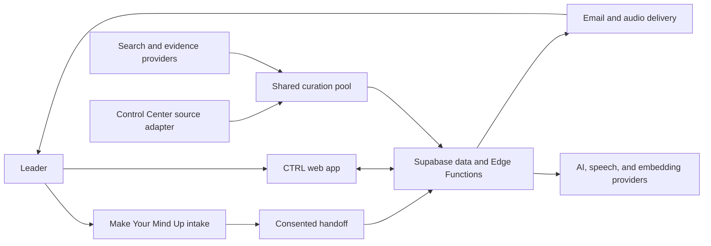

# CTRL architecture

Status: Current
Owner: Mindmaker
Last verified: 2026-09-07 against the source tree at `edd9045`; the deployment counts below come from the management API readback of 2026-08-21 recorded in [release state](./release-state.md)

CTRL is a Vite React application on Vercel with Supabase Auth, PostgreSQL, Edge Functions, Storage, Vault, and scheduled jobs. The architecture has one personal context substrate and one curation pool. Product surfaces are views over those shared systems.

## System context



## Runtime components

| Component | Responsibility | Source |
|---|---|---|
| SPA shell | Routing, auth boundary, persistent desktop/mobile chrome, recovery | `src/App.tsx`, `src/router.tsx`, `src/components/layout/` |
| Product surfaces | Today, Decide, Blind Spot, Memory, Briefing, Settings | `src/pages/` |
| Client orchestration | Queries, ranking, playback, memory, decisions, feedback | `src/hooks/`, `src/contexts/`, `src/lib/` |
| Supabase Edge Functions | AI calls, curation, decision evidence, handoff, delivery, billing | `supabase/functions/` |
| PostgreSQL | User context, decisions, curation cache, briefings, delivery claims, audit state | `supabase/migrations/` |
| Scheduled work | Prewarm, delivery, memory, watch, and lifecycle jobs | migrations using Vault, pg_cron, and pg_net |
| Vercel | Static assets, SPA routing, canonical and redirect hosts | `vercel.json` and project configuration |

The repository contains 115 Edge Function directories excluding `_shared`, 51 hook files, and 165 SQL migrations. These are measured source-tree inventory counts, not design targets.

## The Supabase project is shared

Read this before changing anything server-side.

CTRL does not have a Supabase project to itself. Project `bkyuxvschuwngtcdhsyg`, named "Mindmaker AI", hosts CTRL alongside other Mindmaker surfaces. Verified on 2026-08-21, it carried **178 deployed Edge Functions, and CTRL accounted for 114 of them.** The other 64 belong to workshop and prework tooling, exec-pulse email, the Mindmaker site assistants (`mindy-chat`, `chat-with-krish`), lead capture, and document generation.

Three consequences that matter more than anything else on this page:

1. **Deployed does not mean CTRL's.** A function visible in the Supabase dashboard may belong to another product. Only the 115 directories under `supabase/functions/` are this repository's to change, redeploy, or roll back.
2. **Every function in this repository is live.** 114 of the 115 directories were confirmed deployed and ACTIVE by readback on 2026-08-21. Several have no caller anywhere in this repository because they are invoked by cron, by an external webhook, or by a link in an email: `stripe-webhook` and `resend-webhook` are called by their providers, `decision-watch` and `capture-week` by pg_cron, `unsubscribe-briefing` by a recipient clicking a footer link. Absence of an in-repo caller is not evidence that a function is unused, and deleting one on that basis would remove production code that this repository is the only source for.
3. **The database is shared too.** Tables, roles, and cron jobs outside CTRL's own migrations exist and are not this repository's to alter. Scope every migration to the objects CTRL owns.

The one directory without a recorded deployment is `video-radar-export`, added on 2026-08-28 after that readback. `backfill-pseudonymise`, previously named here as undeployed, was deployed on 2026-08-21 (see [release state](./release-state.md#edge-function-release-2026-08-21)).

The live cron schedule is recorded in [release state](./release-state.md), which is the authority for what is actually running rather than what a migration file requests.

## Frontend boundaries

- `src/router.tsx` is the route authority.
- `AuthedLayoutRoute` owns persistent authenticated chrome.
- `RequireAuth` owns the user boundary for protected routes.
- TanStack Query owns server-state caching. React contexts own cross-surface session state.
- `src/index.css` and the `ctrl-ds` tokens own the product visual system.
- `BrandLockup` owns the product mark. Do not recreate it as text.
- Lazy routes use one recoverable branded loading path and one stale-chunk retry.

The complete current route inventory lives in [features](./features.md) and is checked against `src/router.tsx` during review.

## Data flows

### Intake to First Lens

```text
public answers
  -> optional work email or LinkedIn URL
  -> person and company resolution
  -> company-specific Tavily and Brave retrieval in parallel
  -> deterministic company match, clustering, and source-strength contract
  -> server-sanitised dossier with at most three linked signals
  -> one-click confirmation or correction
  -> short-lived portfolio_handoff
  -> auth or email handoff token
  -> resolve-handoff ownership check
  -> verified user_memory facts and preferences
  -> First Lens
```

Public retry paths converge on stable keys. Raw private sentences do not become authenticated facts without the handoff contract.

`enrich-profile` owns the onboarding dossier. PDL may resolve a person from the supplied work email or LinkedIn profile; Brandfetch may add company identity; Tavily and Brave may return company-specific recent signals. Search providers receive a company query, not the leader's onboarding answers. The server owns URL safety, company matching, excerpts, dates, clustering, and the visible source counts. The browser parses one `OnboardingDossier` contract and never treats decorative progress as evidence that a provider succeeded.

On confirmation, `track-fork` reloads the stored dossier, marks the source response, and copies only the bounded confirmed fields into the idempotent handoff. After authentication, the existing handoff confirmation writes company and role as verified Memory facts and keeps the leader's decision lane as an inferred fact. No generated dossier is accepted from the browser.

### Curation to delivery

```text
source gather
  -> AI-native filter
  -> cross-source clustering and scoring
  -> live_headlines_cache shared pool
  -> per-user brain and preference ranking
  -> Today and briefing
  -> email/audio delivery claim
  -> feedback and preference updates
```

Control Center is an optional read-only source adapter inside `live-headlines`. It does not create another feed. Missing bridge configuration fails closed.

Each cached card carries a subject (`category`) and, since 2026-09-02, two optional additive audience fields written by the same synthesis call: `affects` (which business divisions the story lands on) and `stance` (`opportunity`, `shift`, `risk` or `damage`). A `damage` item, one that reports harm with no move in it for the reader, is dropped before caching (`_shared/news-synthesis.ts`, `live-headlines/index.ts`). Older cache rows without the fields keep working.

The pool has one consumer outside the app. `video-radar-export` (since 2026-08-28) maps the most recent cached days and the current `news_trends` rows into the video studio's candidate contract (`_shared/video-radar-contract.ts`), merging repeated sightings of one story and carrying every distinct public source URL. It is GET only, gated by a bearer token checked in the handler rather than a user JWT, rate limited, and returns only public signal fields. It never writes to the pool.

### Decision engine

```text
decision
  -> AI-native reframe
  -> typed claims
  -> live evidence retrieval
  -> claim adjudication
  -> tensions and advice
  -> optional Edge Pro model panel
  -> watch and outcome history
```

Evidence and model opinion remain distinguishable. The final call belongs to the leader.

### Memory and Blind Spot

```text
explicit fact or correction
  -> validation and ownership
  -> user_memory plus memory_events lineage
  -> shared brain accessor
  -> ranking, briefing, decisions, export

verified intention plus recurrence records
  -> model selects source IDs and writes one short read
  -> server restores exact excerpts, dates, labels, and evidence strength
  -> signed, unstored Blind Spot candidate
  -> ownership, freshness, independence, and support rechecked on confirmation
  -> atomic pattern, evidence-link, and experiment write
  -> one due briefing check-in after at least 24 hours

rejected candidate
  -> reason plus anchor fingerprint only
  -> unchanged evidence suppressed until its inputs change
```

## Core data ownership

| Concern | Representative tables | Write rule |
|---|---|---|
| Identity and context | `profiles`, `user_memory`, `memory_events`, `user_memory_settings` | Owner-scoped or service-mediated |
| Decisions | `decision_cases`, `decision_claims`, `decision_evidence`, `decision_tensions`, `decision_events`, `decision_outcomes` | Authenticated owner |
| Curation | `live_headlines_cache`, `personal_pool_cache`, `news_preferences`, `briefing_interests` | Shared cache plus owner-scoped preference data |
| Briefing | `briefings`, `briefing_feedback`, `user_briefing_directives` | Authenticated owner; delivery is server-mediated |
| Blind Spot | `user_patterns`, `blind_spot_evidence_links`, `blind_spot_experiments`, `blind_spot_rejections` | Candidate remains client-held and signed; confirmation and outcomes are owner-checked service writes |
| Public intake, handoff, and delivery | `cannes_responses`, `portfolio_handoff`, `delivery_subscriptions`, `leader_notification_prefs` | Enrichment is provisional; transfer is validated, consented, bounded, and idempotent |
| Billing | `edge_subscriptions` and Stripe event records | Server and signed webhook only |

All schema truth comes from migrations plus production readback. A table list in prose is illustrative unless a check maintains it.

## AI and external-provider routing

Provider routing is capability-specific. There is no truthful single sentence such as “Vertex primary, OpenAI fallback” for the whole product.

| Capability | Current code path |
|---|---|
| Onboarding result and Blind Spot | OpenAI first, Gemini fallback through `_shared/llm-fallback.ts` |
| Onboarding identity and company signals | PDL and Brandfetch for resolution; Tavily and Brave for recent company-specific evidence; deterministic server qualification |
| Briefing script and curation | OpenAI chat-completions execution, default `gpt-4o-mini`; model selection metadata may be benchmark-assisted |
| Briefing and Blind Spot conversation | OpenAI `gpt-4o-mini`, grounded only in the displayed briefing or signed Blind Spot anchors |
| Decision reasoning | Anthropic Claude first, OpenAI GPT-4o fallback |
| Decision claim adjudication | OpenAI `gpt-4o-mini` |
| Edge Pro cross-examination | Available panel members from Claude, GPT-4o, Gemini, and Grok; failures are dropped, not fabricated |
| Voice transcription | OpenAI transcription first, Gemini fallback |
| Briefing speech | ElevenLabs |
| Embeddings | OpenAI `text-embedding-3-small` |
| Legacy/general AI generation | Function-specific routing; inspect the called function before making a provider claim |

Search and evidence paths use a bounded mix of Perplexity, Tavily, Brave, Jina, NewsAPI.org, Exa, Artificial Analysis, RSS, GDELT, and Hacker News. Provider availability must degrade honestly.

## Trust boundaries

- Browser code receives only publishable Supabase credentials.
- Service-role and provider credentials remain Edge Function secrets.
- RLS is the default data boundary; service-role functions must independently establish user ownership.
- `supabase/config.toml` is the function JWT contract. A `verify_jwt=false` function must validate a webhook signature, cron secret, service role, or deliberately public bounded input in its handler.
- Stripe webhooks are signature-verified and idempotent.
- Cron calls use the Vault-backed `CTRL_CRON_SECRET`, not a database service-role setting.
- Public inputs validate size and shape, rate-limit costly paths, and converge on retry.
- Logs must not contain secrets or unbounded private content.

## Deployment shape

- Vercel is Git-connected to `main` and serves the SPA.
- Supabase functions deploy independently from frontend releases.
- Production has historical migration-ledger drift. Never apply a blanket production `supabase db push`.
- The safe migration and rollback process lives in the [replication and release guide](../../project-documentation/REPLICATION_GUIDE.md).
- `makeyourmindup.ai` is canonical. The former CTRL host remains a permanent redirect only.

## Architecture invariants

1. One brain accessor, not per-surface context stores.
2. One shared curation pool, not per-channel feeds.
3. Explicit facts, inferred candidates, and behavioral feedback remain different data types.
4. Every user-scoped read and write proves ownership.
5. Retryable writes converge.
6. Provider failure is visible and bounded.
7. Current architecture lives here; release chronology lives in Git and historical records.

## Change triggers

Update this document in the same change when routes, core tables, provider order, auth contracts, cron authentication, curation boundaries, or deployment mechanics change.
